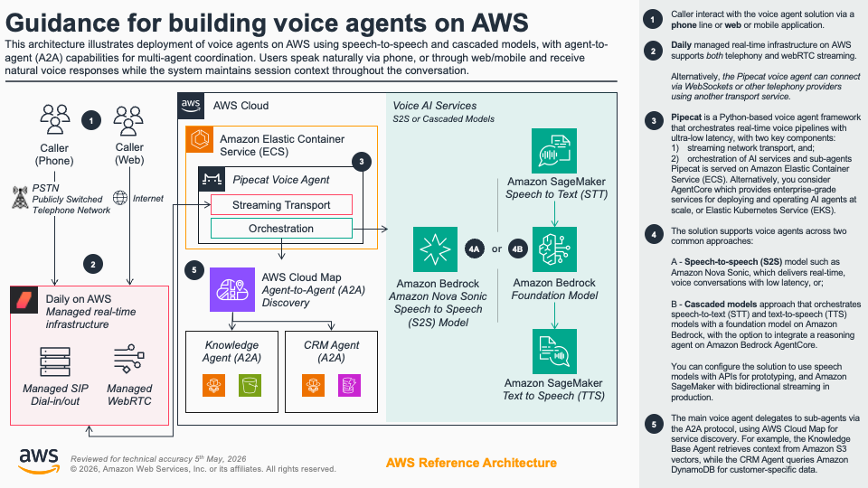
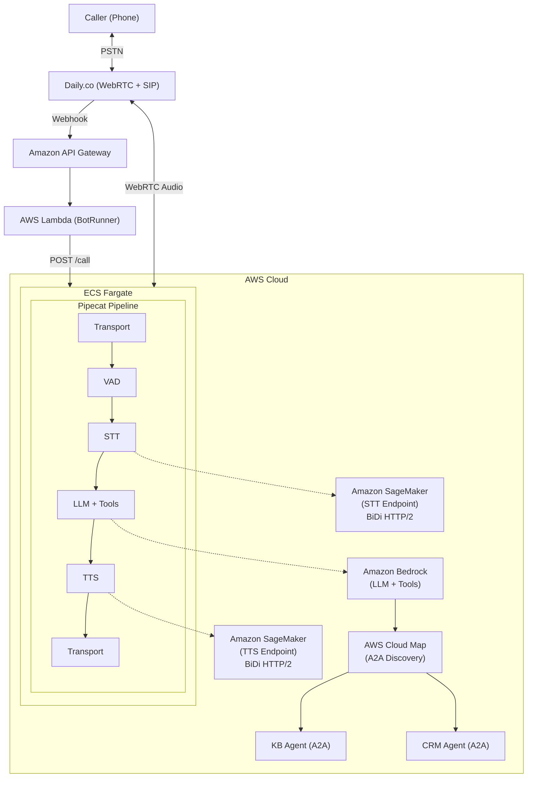

# Guidance for voice agents on AWS

[](LICENSE)
[](https://www.python.org/)
[](https://nodejs.org/)
[](https://aws.amazon.com/cdk/)
[](https://github.com/pipecat-ai/pipecat)

A sample foundation for building real-time voice AI agents on AWS. Handles phone calls over SIP/PSTN and voice interactions in web/mobile applications via WebRTC.

## Getting Started

### Prerequisites

- **Node.js 18+** and **Python 3.12+**
- **AWS CLI v2** configured with credentials
- **Finch** (or Docker) for container builds
- **Amazon Bedrock** model access enabled in your target Region
- **Daily.co** account (for phone/SIP transport -- not needed for local prototyping)

```bash
node --version    # v18.x or higher
python3 --version # 3.12.x or higher
aws --version     # aws-cli/2.x
finch --version   # or docker --version
```

If this is your first time using AWS CDK in your account/Region:

```bash
npx cdk bootstrap aws://ACCOUNT_ID/REGION
```

### Deploy (AI-Guided, ~15 minutes)

```bash
git clone https://github.com/aws-samples/sample-voice-agent.git
cd sample-voice-agent
```

Open in Claude Code (or your preferred AI-assisted IDE) and choose a deployment mode:

**Cloud API mode** (quickest start -- uses Deepgram + Cartesia cloud APIs):

1. **`/deploy-cloud-api`** -- Checks prerequisites, gathers API keys, deploys CDK stacks
2. **`/configure-daily`** -- Sets up a phone number with PSTN dial-in
3. **`/verify-deployment`** -- Health-checks all components

**Amazon SageMaker mode** (production -- self-hosted STT/TTS, audio stays in VPC):

1. **`/deploy-sagemaker`** -- Deploys CDK stacks with GPU-backed STT/TTS endpoints
2. **`/configure-daily`** -- Sets up a phone number with PSTN dial-in
3. **`/verify-deployment`** -- Health-checks all components

> SageMaker mode requires GPU quota for `ml.g6.2xlarge` and `ml.g6.12xlarge` ([request via Service Quotas](https://console.aws.amazon.com/servicequotas/)) and [Deepgram Marketplace subscriptions](docs/reference/deepgram-marketplace-setup.md).

You now have a callable phone number with a voice AI agent.

> For manual deployment, see the [Deployment Guide](infrastructure/DEPLOYMENT.md).

### Try It Locally (No Phone Number Needed)

Test the full voice pipeline from your browser without any Daily.co account or SIP infrastructure:

```bash
cd backend/voice-agent
pip install -r requirements.txt
cp .env.example .env
# Edit .env: set DEEPGRAM_API_KEY, CARTESIA_API_KEY, AWS_REGION

python -m app.local_main
# Open http://localhost:7860 and click Connect
```

Speak into your microphone and hear the agent respond. All pipeline features (tool calling, filler phrases) work identically to production.

## Overview

- **Flexible orchestration** -- [Pipecat](https://github.com/pipecat-ai/pipecat) open-source framework for voice AI pipelines
- **Plug-in models** -- Supports STT, TTS, and LLM providers
- **Phone and web** -- Daily SIP/PSTN dial-in and managed WebRTC
- **Extensible agents** -- Agent-to-agent (A2A) hub-and-spoke architecture with AWS Cloud Map discovery
- **AWS-native** -- Amazon ECS Fargate with auto-scaling, Amazon Bedrock for LLM, optional self-hosted STT/TTS on Amazon SageMaker

### Architecture



<details>
  <summary>Detailed diagram</summary>



1. Caller dials the PSTN phone number → Daily.co via SIP
2. Daily.co webhook → API Gateway → BotRunner Lambda → spawns ECS voice pipeline
3. Pipecat processes audio in real-time: Transport → VAD → STT → LLM (Bedrock) → TTS → Transport
4. LLM can invoke local tools or discover remote A2A capability agents via Cloud Map
</details>

### Cost

~$135-200/mo (Cloud API) or ~$935-1,200/mo (SageMaker mode with GPU instances). [Full breakdown →](docs/reference/cost-estimation.md)

## Next Steps

| What | How |
| ---- | --- |
| Add capability agents (KB, CRM) | `/deploy-capability-agents` |
| Create a custom tool | `/create-local-tool` |
| Scaffold a new A2A agent | `/create-capability-agent` |
| Deploy with self-hosted STT/TTS | `/deploy-sagemaker` |
| Configure call transfers | Set `TRANSFER_DESTINATION` env var. [Details →](docs/reference/call-transfers.md) |
| Tune auto-scaling | Adjust `targetSessionsPerTask`, `minCapacity`, `maxCapacity` via CDK context |

## Cleanup

```bash
# AI-guided (recommended):
# Run /destroy-project in Claude Code

# Manual:
cd infrastructure
npx cdk destroy --all --force
```

See the [Deployment Guide](infrastructure/DEPLOYMENT.md) for full manual cleanup steps including Daily.co phone number release.

## Project Structure

```
├── infrastructure/           # CDK infrastructure code
│   ├── src/
│   │   ├── stacks/          # CloudFormation stacks
│   │   ├── constructs/      # Reusable CDK constructs
│   │   └── functions/       # AWS Lambda function code
│   ├── scripts/             # Deployment & setup scripts
│   └── test/                # Infrastructure tests
├── backend/
│   ├── voice-agent/         # Voice pipeline container (hub)
│   │   ├── app/
│   │   │   ├── services/    # STT/TTS/LLM service factories
│   │   │   ├── tools/       # Tool framework + built-in tools
│   │   │   ├── a2a/         # A2A capability agent integration
│   │   │   ├── pipeline_ecs.py   # Pipecat pipeline (Daily transport)
│   │   │   ├── pipeline_local.py # Pipecat pipeline (SmallWebRTC transport)
│   │   │   ├── local_main.py     # Local prototyping entry point
│   │   │   ├── observability.py  # Metrics observers
│   │   │   └── service_main.py   # HTTP service (aiohttp)
│   │   ├── tests/           # Python tests
│   │   └── Dockerfile       # Container definition (Python 3.12)
│   └── agents/              # A2A capability agents (spokes)
│       ├── knowledge-base-agent/  # KB RAG agent
│       └── crm-agent/            # CRM agent (5 tools)
├── docs/
│   ├── guides/              # Developer guides
│   ├── patterns/            # Architecture patterns
│   └── reference/           # Reference documentation
└── resources/               # Sample data (KB documents)
```

## Documentation

| Topic | Link |
| ----- | ---- |
| Full Deployment Guide | [infrastructure/DEPLOYMENT.md](infrastructure/DEPLOYMENT.md) |
| Cost Estimation | [docs/reference/cost-estimation.md](docs/reference/cost-estimation.md) |
| Troubleshooting | [docs/reference/troubleshooting.md](docs/reference/troubleshooting.md) |
| Daily.co Setup | [docs/reference/daily-setup.md](docs/reference/daily-setup.md) |
| Deepgram Marketplace Setup | [docs/reference/deepgram-marketplace-setup.md](docs/reference/deepgram-marketplace-setup.md) |
| Call Transfers | [docs/reference/call-transfers.md](docs/reference/call-transfers.md) |
| Adding a Capability Agent | [docs/guides/adding-a-capability-agent.md](docs/guides/adding-a-capability-agent.md) |
| Adding a Local Tool | [docs/guides/adding-a-local-tool.md](docs/guides/adding-a-local-tool.md) |
| Capability Agent Pattern | [docs/patterns/capability-agent-pattern.md](docs/patterns/capability-agent-pattern.md) |
| Scaling | [docs/reference/scaling.md](docs/reference/scaling.md) |

## Revisions

| Date | Description |
| ---- | ----------- |
| March 2026 | Initial release -- Cloud API and Amazon SageMaker deployment modes, A2A capability agents, auto-scaling |

## Notices

*Customers are responsible for making their own independent assessment of the information in this Guidance. This Guidance: (a) is for informational purposes only, (b) represents AWS current product offerings and practices, which are subject to change without notice, and (c) does not create any commitments or assurances from AWS and its affiliates, suppliers or licensors. AWS products or services are provided "as is" without warranties, representations, or conditions of any kind, whether express or implied. AWS responsibilities and liabilities to its customers are controlled by AWS agreements, and this Guidance is not part of, nor does it modify, any agreement between AWS and its customers.*

## Authors

- [Court Schuett](https://github.com/schuettc)
- [Daniel Wirjo](https://github.com/wirjo)
- [Victor Wang](https://www.linkedin.com/in/vwang1111/)
- [Evan Grenda](https://www.linkedin.com/in/evan-grenda/)

## Security

See [CONTRIBUTING](CONTRIBUTING.md#security-issue-notifications) for more information.

## License

This library is licensed under the MIT-0 License. See the [LICENSE](LICENSE) file.
